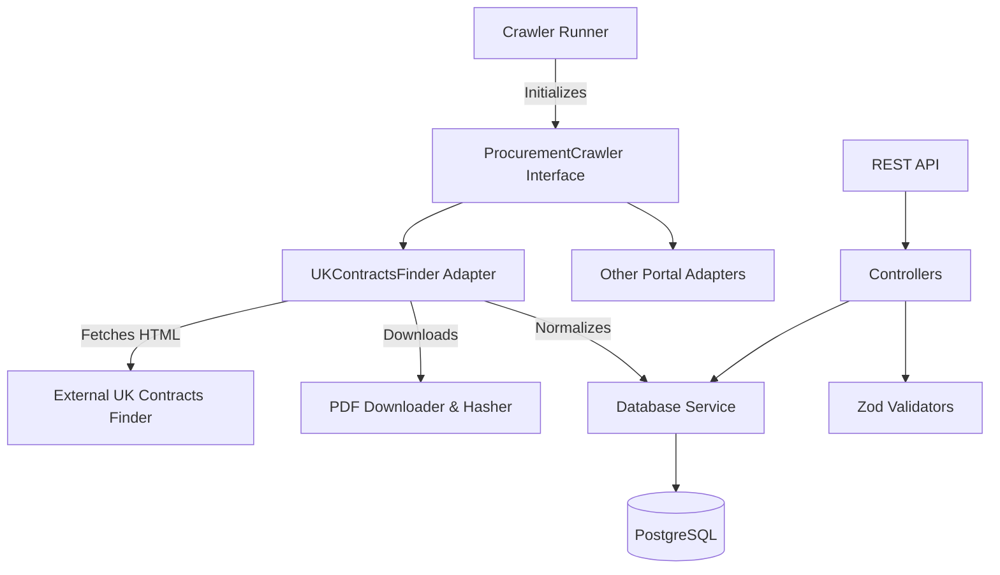

# Architecture Document

## Overview
The Valgan Procurement Crawler POC employs a modular, interface-driven architecture to allow seamless addition of multiple procurement portals without duplicating core crawling, normalization, or database logic.

## System Architecture

## Core Components
1. **Crawler Core (`src/crawlers/core/`)**
   - Defines the `ProcurementCrawler` interface that all portal adapters must implement.
   - Enforces standardization of `crawlListings`, `crawlTenderDetails`, `downloadDocument`, and `normalizeTender`.

2. **Portal Adapters (`src/crawlers/portals/`)**
   - Contains portal-specific HTML parsing, DOM traversal, and request logic.
   - Converts proprietary HTML structures into a standardized `Tender` payload.

3. **Database Layer (`src/database/`)**
   - Utilizes Prisma ORM for type-safe database interactions.
   - Implements robust upsert logic using a composite key `[portalName, tenderId]` to prevent duplicates.

4. **API Layer (`src/controllers/`, `src/routes/`)**
   - Express REST API exposing search and retrieval of parsed tenders.
   - Includes pagination, case-insensitive search, and sorting.

5. **Utilities**
   - `logger.ts`: Pino-based structured JSON logger.
   - `file.ts`: Handles secure PDF saving and SHA-256 hashing.
