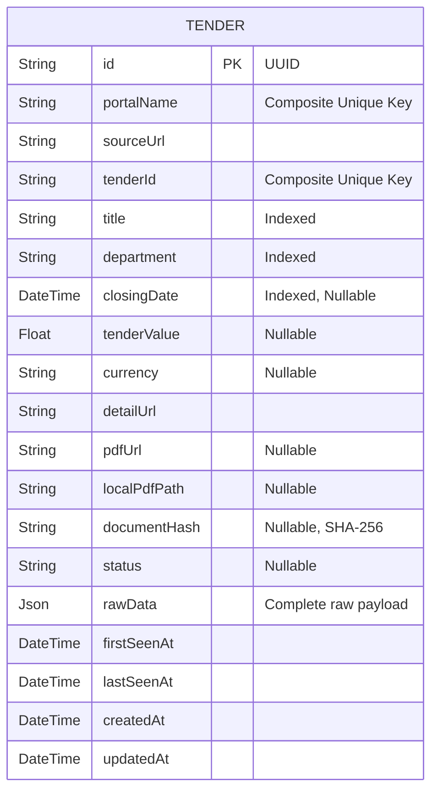

# Database Schema

The database utilizes PostgreSQL and is queried securely via the Prisma ORM.

### Key Constraints:
- `portalName` + `tenderId` form a unique composite key, preventing duplicates across different portals that might coincidentally use the same reference number.
- `tenderValue` and `closingDate` are heavily indexed as they are the primary metrics utilized in BI dashboards and analytical filtering queries.
